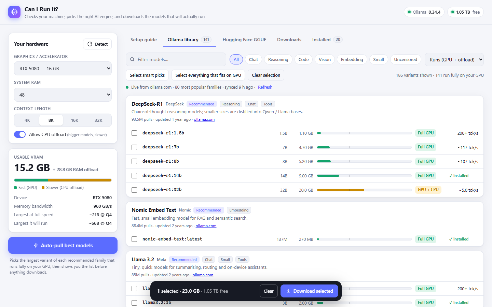
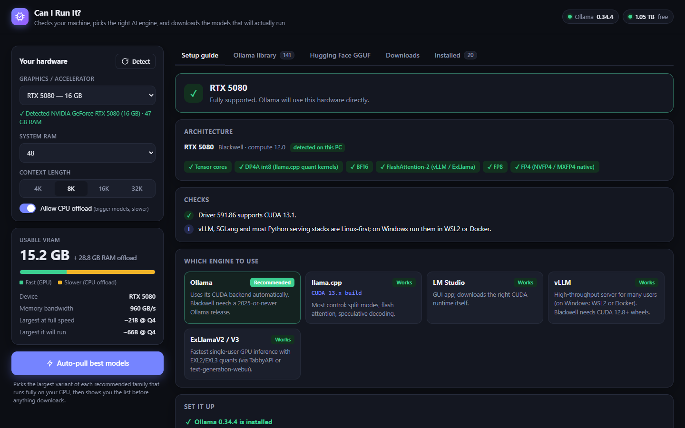
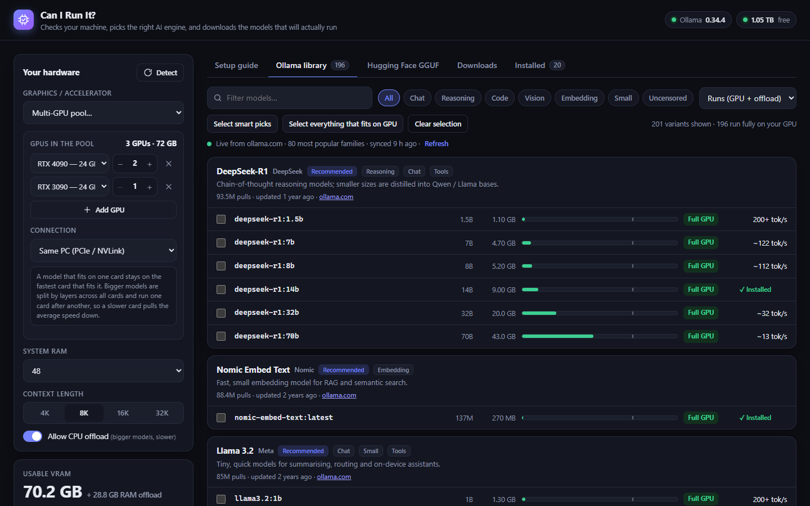
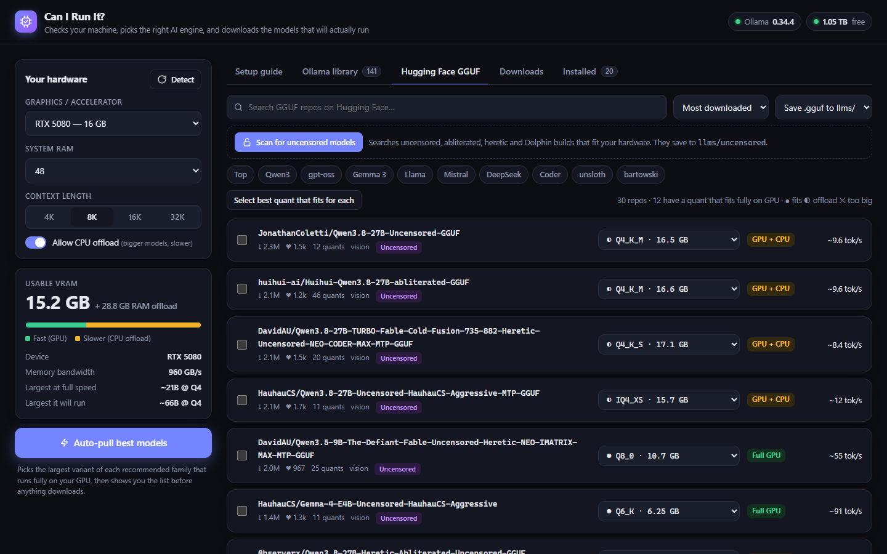
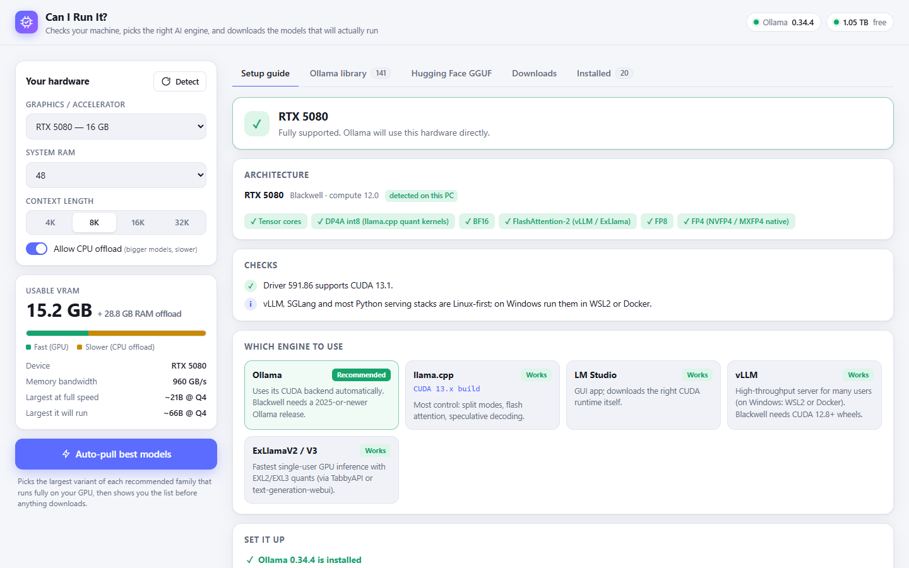

<div align="center">

# Can I Run It?

### Stop guessing which AI models your PC can handle.

Pick your GPU or click **Detect**, and in seconds you know which local LLMs will run, how fast, and which engine to use. Then download the best ones in one click.

[](../../releases/latest)
[](../../releases/latest)
[](../../releases)
[](LICENSE)

**One file · nothing to install · no account · no telemetry**

<picture>
  <source media="(prefers-color-scheme: dark)" srcset="docs/screenshots/library-dark.png">
  
</picture>

</div>

## Sound familiar?

- *"Will a 70B model fit on my 3090?"*
- *"Q4_K_M, IQ4_XS or Q6_K? Which quant should I grab?"*
- *"Does my old GTX 1070 still work now that CUDA 13 is out?"*
- *"I have an AMD card. Ollama, ROCm or Vulkan?"*
- *"How fast will it actually be?"*

**Can I Run It?** answers all of these for *your* exact machine, then gets the models for you.

## What you get

| | |
|---|---|
| 🎯 **Every model rated for your hardware** | *Full GPU*, *GPU + CPU* or *Too large* at your context length, with an estimated tokens/sec. Covers the live Ollama library and any Hugging Face GGUF. |
| ⚡ **One-click Auto-pull** | Grabs the newest, biggest model in each family that runs fast on your card. You see the list and total size first. |
| 🧭 **Setup guide for your GPU** | The right engine and the exact build (CUDA 13 / 12.4, ROCm, Vulkan, SYCL, Metal), driver checks, and copy-paste commands. |
| 🧓 **Old hardware welcome** | Kepler, Pascal (P40!), Volta, RX 580, MI50, Arc… It tells you what still works and how. |
| 🖥️🖥️ **Multi-GPU and clusters** | Pool any cards (2× 4090 + 3090?) in one PC or across networked PCs, and see what fits once VRAM is combined. |
| 🍎 **Every platform** | NVIDIA, AMD, Intel Arc, Apple Silicon M1–M6 (incl. M5 Max/Ultra), Ryzen AI Max, DGX Spark, plain CPUs. |
| 🔓 **Uncensored scan** | Finds abliterated / uncensored / Dolphin builds that fit, saved to a separate folder and never auto-pulled. |
| ⏯️ **Downloads that survive anything** | Pause, resume, close the app, reboot. The queue picks up where it left off. |

<table>
  <tr>
    <td width="50%"><br><sub><b>Setup guide</b>: architecture, features, driver checks, and which engine and build to use</sub></td>
    <td width="50%"><br><sub><b>Multi-GPU pool</b>: 2× 4090 + 3090 runs 70B fully on GPU at ~13 tok/s</sub></td>
  </tr>
  <tr>
    <td width="50%"><br><sub><b>Hugging Face GGUF + uncensored scan</b>: the best quant picked for your VRAM</sub></td>
    <td width="50%"><br><sub><b>Light and dark themes</b>, following your system setting</sub></td>
  </tr>
</table>

## Get started in 3 steps

1. **Download** the file for your system from **[Releases](../../releases/latest)**.
2. **Run it.** Your browser opens automatically, and it detects your hardware.
3. **Click "Auto-pull best models"**, or pick your own.

## Download

Get the latest standalone build from **[Releases](../../releases/latest)**. Nothing else needs installing: Node.js is built in.

| System | File |
|---|---|
| Windows 10/11 (x64) | `can-i-run-it-windows-x64.zip` |
| Linux x64 | `can-i-run-it-linux-x64.tar.gz` |
| Linux ARM64 (DGX Spark, Jetson, Pi 5…) | `can-i-run-it-linux-arm64.tar.gz` |
| macOS Apple Silicon (M1–M6) | `can-i-run-it-macos-arm64.tar.gz` |
| macOS Intel | `can-i-run-it-macos-x64.tar.gz` |

Unpack it and run it. Your browser opens at http://localhost:5180. Keep the window open while you use the app.

**First run:** the builds aren't code-signed yet, so your OS may warn you.

- **Windows**: SmartScreen → *More info* → *Run anyway*.
- **macOS**: right-click the file → *Open*. Or run `xattr -d com.apple.quarantine can-i-run-it-macos-*`.
- **Linux**: `chmod +x can-i-run-it-linux-*` and then `./can-i-run-it-linux-x64`.

Models download into a `llms/` folder next to the program. Set `LLMS_DIR` to put them on another drive.

## Run from source

Needs Node.js 20+. There are no npm dependencies.

| OS | |
|---|---|
| Windows | double-click `start.bat` |
| macOS | double-click `start.command` |
| Linux / macOS terminal | `sh start.sh` |
| Anywhere | `npm start` or `node server.js --open` |

## Where models go

| What | Folder |
|---|---|
| Hugging Face GGUF | `llms/huggingface/<user>__<repo>/` |
| Uncensored GGUF | `llms/uncensored/<user>__<repo>/` |
| Ollama | `OLLAMA_MODELS`. If Ollama isn't running, the app starts it with `llms/ollama`. |

GGUF files work with llama.cpp, LM Studio, KoboldCpp and Jan.

## Settings (environment variables)

| Variable | Default | Purpose |
|---|---|---|
| `PORT` | `5180` | Web UI port |
| `LLMS_DIR` | `./llms` | Where models are downloaded |
| `OLLAMA_MODELS` | Ollama default | Ollama's model store |
| `HF_TOKEN` | — | Needed for gated Hugging Face repos |
| `MAX_PARALLEL` | `2` | Concurrent downloads |
| `OLLAMA_HOST` | `127.0.0.1:11434` | Ollama API address |
| `AUTO_START_OLLAMA` | `1` | `0` = never start Ollama automatically |
| `OLLAMA_LIBRARY_SIZE` | `80` | How many ollama.com families to sync |

Flags: `--open` opens the browser (packaged builds do this by default), and `--no-open` stops it.

## Build the standalone executables

```
npm run build                      # single-file executable for this OS → dist/
```

Pushing a `v*` tag runs `.github/workflows/release.yml`. It builds Windows x64, Linux x64/ARM64 and macOS ARM64/x64 on GitHub's runners, smoke-tests each one, and publishes them to a Release. The builds use [Node.js Single Executable Applications](https://nodejs.org/api/single-executable-applications.html), with the UI embedded.

## Project layout

```
server.js                 Node server: detection, ollama.com sync, HF search/scan, download queue
public/advisor.js         GPU architecture rules → engines, builds, drivers, setup steps
public/app.js             UI: fit/speed model, multi-GPU pool, model picks
data/hardware.json        ~140 GPUs / Macs with VRAM + bandwidth (PRs welcome)
data/ollama-catalog.json  curated Ollama notes
scripts/build.js          single-file executable builder
```

## How the estimates work

- **Fit** = weights + KV cache for the chosen context (about √size × 0.35 GB per 8K tokens) + 0.4 GB. That's compared with VRAM minus 0.8 GB for the display card (0.5 GB for each other card).
- **Speed** = memory bandwidth × an efficiency factor for the GPU generation, plus a small per-token cost for each extra GPU.
- **Multi-GPU**: a model stays on one card if it fits. Otherwise it's split by layers, and the cards' speeds combine.

These are estimates: real numbers depend on the engine, the drivers and the workload. Engine support changes over time, and the rules are kept in `public/advisor.js` so they're easy to update.

## Credits

Made by **Paul Bardell - Cobolt60 Studios**, 2026. Licensed under the [Apache License 2.0](LICENSE).
